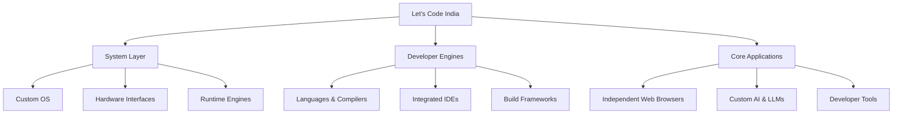

# Welcome to Let's Code India

### Building the Entire Software Universe from First Principles.

     

---

### 📈 The Core Philosophy

> "If it runs on code, we build it ourselves."

Most software today is built on top of pre-existing frameworks, libraries, and abstraction layers. **Let's Code India** was founded on a different path: **Pure Engineering**.

We don't restrict ourselves to a single language, tool, or domain. We construct complete, independent digital tools from the bare ground up — learning, reverse-engineering, and innovating at every layer of computing.

### ⚡ What We Design & Create

Our work spans every corner of computer science and software development:

No single one of these is "the project" — every branch above gets equal focus as it develops. Today it's a language and its docs; the same energy goes into whatever comes next.

### 🎯 Why This Organization Exists

1. **Absolute Independence** — Building tools without relying on heavy external dependencies.
2. **Deep System Mastery** — Understanding every machine instruction, compiler phase, and architecture detail by writing it ourselves.
3. **Open Architecture for Everyone** — Creating a massive knowledge base where anyone can learn real engineering, contribute code, and grow.

### 🤝 How to Join & Contribute

Whether you are a low-level systems programmer, an AI enthusiast, an app developer, or someone eager to learn how software works beneath the surface — **you belong here**.

- 🔍 **Explore** — Check our repositories to see active engines, tools, and systems.
- 💬 **Engage** — Join discussions, open issues, and share architecture ideas.
- 🛠️ **Build** — Pick up any issue, submit pull requests, or propose a brand-new original project under the org.

*Driven by curiosity. Powered by code. Built without limits.*

